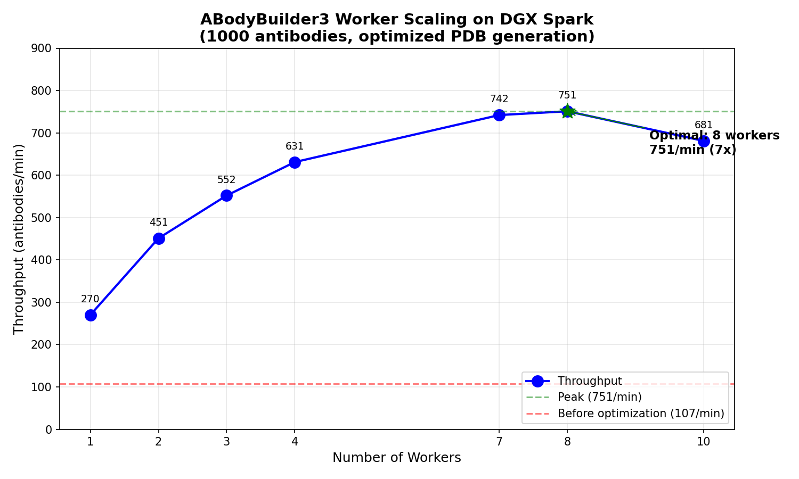

# ABodyBuilder3 for NVIDIA DGX Spark (ARM64 / Grace Blackwell GB10)

This repository provides a specialized Docker deployment for running **ABodyBuilder3** (antibody structure prediction) on the NVIDIA DGX Spark system, powered by **Grace Blackwell (GB10)** GPUs and **ARM64** architecture.

## What is ABodyBuilder3?

ABodyBuilder3 is a state-of-the-art deep learning model for predicting antibody variable region structures from sequence. It achieves high accuracy on CDR loops (especially CDRH3) by leveraging ProtT5 language model embeddings and includes per-residue confidence scores (pLDDT).

**Paper**: [ABodyBuilder3: Improved and scalable antibody structure predictions](https://doi.org/10.1093/bioinformatics/btae576) (Bioinformatics, 2024)

## Why This Exists

The original ABodyBuilder3 was developed for x86_64 with CUDA 11.7 and Python 3.9. DGX Spark uses ARM64 and Blackwell GPUs (sm_120/sm_121), requiring custom builds with specific compatibility fixes.

This build solves:
- **Flash Attention API**: Updated imports for NGC container's newer flash_attn version
- **OpenMM Source Build**: Builds OpenMM from source for full Blackwell GPU relaxation support
- **PyTorch 2.10 Compatibility**: Handles stricter `weights_only=True` checkpoint loading
- **CUDA 13 Support**: Uses NGC 25.11 with native CUDA 13.0 and Python 3.12

## Benchmark Results

Benchmarks run on **NVIDIA DGX Spark** (Grace Blackwell GB10, 128.5GB unified RAM).

*Benchmark date: 2025-12-24 | CUDA 13.0 | PyTorch 2.10 | 1000 antibodies*

### Worker Scaling

| Workers | Throughput | Speedup vs Baseline |
|---------|------------|---------------------|
| 1 | 270/min | 2.5x |
| 2 | 451/min | 4.2x |
| 3 | 552/min | 5.2x |
| 4 | 631/min | 5.9x |
| 5 | 694/min | 6.5x |
| 6 | 740/min | 6.9x |
| 7 | 742/min | 6.9x |
| **8** | **751/min** | **7.0x** |
| 10 | 681/min | 6.4x |

> **Optimal: 8 workers = 751 antibodies/minute** (7x faster than 107/min baseline)



### Optimization Summary

| Metric | Before | After | Improvement |
|--------|--------|-------|-------------|
| Throughput | 107/min | **751/min** | **7x faster** |
| Per antibody | 0.56s | 0.08s | 7x faster |
| Bottleneck | PDB generation (91%) | GPU inference (63%) | Fixed |

### Key Observations

- **Peak throughput**: 751 antibodies/minute with 8 workers
- **Optimal workers**: 8 (performance drops at 10+ due to GPU contention)
- **Bottleneck**: Now GPU inference, not CPU PDB generation

## Quick Start

### 1. Build the Docker Image

```bash
# Clone this repository
git clone https://github.com/adrian-greenneuron/ABodyBuilder3-DGX-Spark.git
cd ABodyBuilder3-DGX-Spark

# Build with the build script (recommended, ~15-20 minutes)
./docker_build.sh build

# Or build manually
DOCKER_BUILDKIT=1 docker build -t abodybuilder3-spark:latest .
```

### 2. Run the Test

```bash
./docker_build.sh test
```

Expected output:
```
============================================================
ABodyBuilder3 Docker Image Test
============================================================
PyTorch version: 2.10.0a0+b558c986e8.nv25.11
CUDA version: 13.0
OpenMM version: 8.4.0
CUDA available: True
GPU: NVIDIA GB10
GPU Memory: 128.5 GB
============================================================
All imports successful!
```

### 3. Predict an Antibody Structure

```bash
docker run --rm --gpus all --ipc=host \
    -v $(pwd)/scripts:/scripts \
    -v $(pwd)/output:/output \
    abodybuilder3-spark:latest \
    python3 /scripts/test_inference.py
```

Output:
```
✅ Structure prediction successful!
  Output file: /tmp/test_antibody.pdb
  Total atoms: 3407
  Total residues: 229
```

## Usage Examples

### Basic Inference (Python)

```python
import torch
import ml_collections
from abodybuilder3.utils import string_to_input, output_to_pdb, add_atom37_to_output
from abodybuilder3.lightning_module import LitABB3

# Required for PyTorch 2.10+ checkpoint loading
torch.serialization.add_safe_globals([ml_collections.ConfigDict])

# Your antibody sequences
heavy = "QVQLVQSGAEVKKPGSSVKVSCKASGGTFS..."
light = "DIQMTQSPSTLSASVGDRVTITCRASQSIS..."

# Load model
module = LitABB3.load_from_checkpoint("output/plddt-loss/best_second_stage.ckpt")
model = module.model.eval().cuda()

# Prepare input and run inference
ab_input = string_to_input(heavy=heavy, light=light)
ab_input_batch = {k: v.unsqueeze(0).cuda() if k not in ["single", "pair"] else v.cuda() 
                  for k, v in ab_input.items()}

with torch.no_grad():
    output = model(ab_input_batch, ab_input_batch["aatype"])
    output = add_atom37_to_output(output, ab_input["aatype"].cuda())

pdb_string = output_to_pdb(output, ab_input)
```

### Available Models

| Model | Checkpoint Path | Description |
|-------|-----------------|-------------|
| **pLDDT** (recommended) | `output/plddt-loss/best_second_stage.ckpt` | Includes confidence scores |
| Base | `output/base-loss/best_second_stage.ckpt` | Standard model, faster |
| Language | `output/language-loss/best_second_stage.ckpt` | Best CDR accuracy with ProtT5 |

### Parallel Processing

Use `--workers` to control parallelism. Each worker loads its own model copy and processes antibodies independently.

```bash
# Maximum throughput (recommended)
python3 scripts/predict.py predict --csv input.csv -o output/ --workers 4

# Single worker (lower memory, slower)
python3 scripts/predict.py predict --csv input.csv -o output/ --workers 1
```

> **Tip**: With 4 workers on DGX Spark, expect ~107 antibodies/minute.

## Repository Structure

```
├── Dockerfile              # DGX Spark optimized build
├── docker_build.sh         # Build/test/shell helper script
├── scripts/
│   └── test_inference.py   # Inference test script
├── src/abodybuilder3/      # Model source code
├── output/                 # Model weights (downloaded during build)
└── README.md               # This file
```

## Technical Details

| Component | Version |
|-----------|---------|
| **Base Image** | `nvcr.io/nvidia/pytorch:25.11-py3` |
| **CUDA** | 13.0 |
| **PyTorch** | 2.10 |
| **Python** | 3.12 |
| **OpenMM** | 8.4.0 (built from source) |
| **Flash Attention** | 2.7.4 (NGC built-in) |
| **Triton** | 3.5.0 (NGC built-in) |

### Key Fixes Applied

| Fix | Purpose |
|-----|---------|
| `primitives.py` flash_attn imports | Handle NGC's newer Flash Attention API |
| `setup.cfg` version relaxation | Allow numpy/scipy/pandas compatible with Python 3.12 |
| PyTorch safe globals | Register `ml_collections.ConfigDict` for `weights_only=True` |
| OpenMM source build | Blackwell sm_120/sm_121 GPU compatibility |

## Requirements

- **Hardware**: NVIDIA DGX Spark (Grace Blackwell / GB10)
- **Docker**: 20.10+ with NVIDIA Container Toolkit
- **Disk Space**: ~25GB for the Docker image
- **Memory**: 16GB+ recommended

## Data Sources

Model weights are automatically downloaded from [Zenodo](https://zenodo.org/records/11354577) during Docker build:
- `output.tar.gz` (~1.3GB) - Pre-trained model checkpoints

For training data and language model embeddings, run:
```bash
./download.sh
```

## Troubleshooting

### "ModuleNotFoundError: No module named 'flash_attn.flash_attention'"
This is fixed in this repository. The NGC container uses a newer flash_attn API without the legacy `FlashAttention` class.

### "WeightsUnpickler error: Unsupported global: ConfigDict"
Add this before loading checkpoints:
```python
import ml_collections
torch.serialization.add_safe_globals([ml_collections.ConfigDict])
```

### OpenMM/pdbfixer import errors
Ensure you're using the Docker image from this repository, which builds OpenMM from source for Blackwell compatibility.

## Citation

If you use ABodyBuilder3, please cite:

```bibtex
@article{abodybuilder3,
    author = {Kenlay, Henry and Dreyer, Frédéric A and Cutting, Daniel and Nissley, Daniel and Deane, Charlotte M},
    title = "{ABodyBuilder3: improved and scalable antibody structure predictions}",
    journal = {Bioinformatics},
    volume = {40},
    number = {10},
    pages = {btae576},
    year = {2024},
    doi = {10.1093/bioinformatics/btae576}
}
```

## Resources

- [Original ABodyBuilder3 Repository](https://github.com/Exscientia/abodybuilder3)
- [ABodyBuilder3 Paper](https://doi.org/10.1093/bioinformatics/btae576)
- [Zenodo Data](https://zenodo.org/records/11354577)
- [NVIDIA NGC PyTorch Containers](https://catalog.ngc.nvidia.com/orgs/nvidia/containers/pytorch)

## License

Apache 2.0 (same as original ABodyBuilder3)
